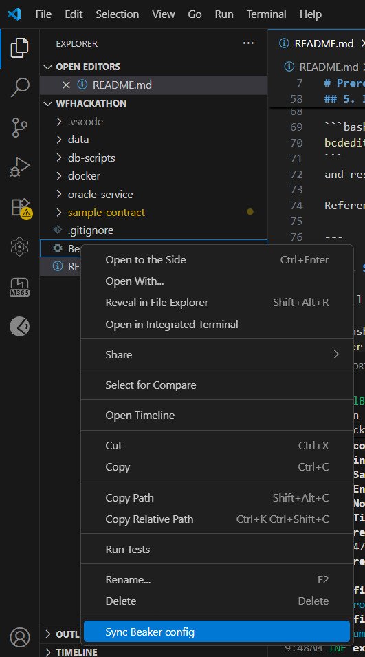
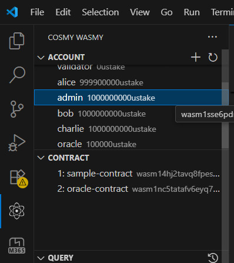
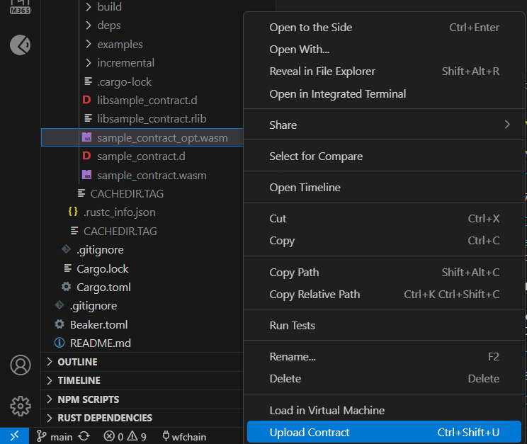
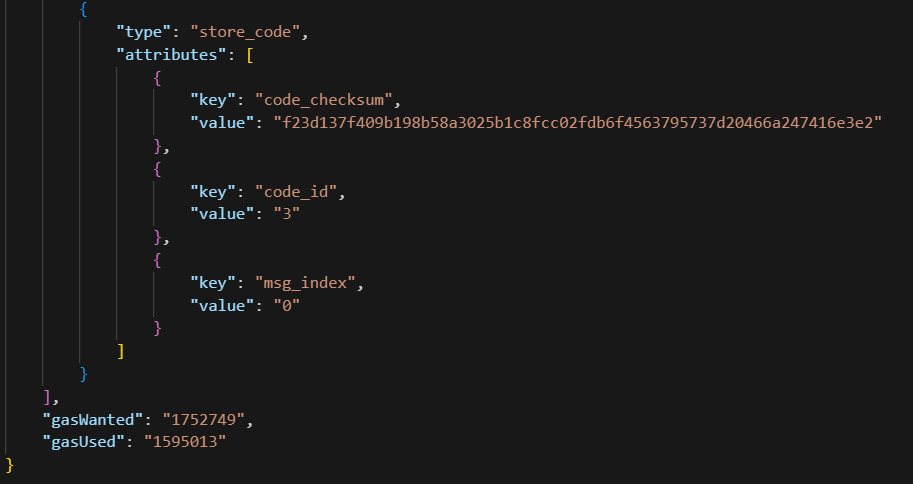
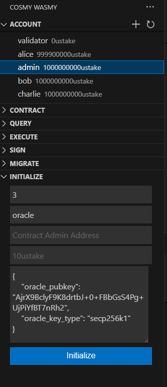
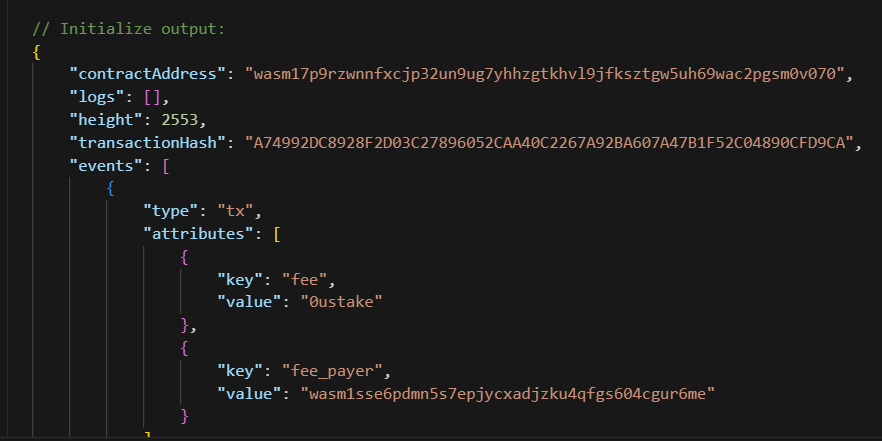
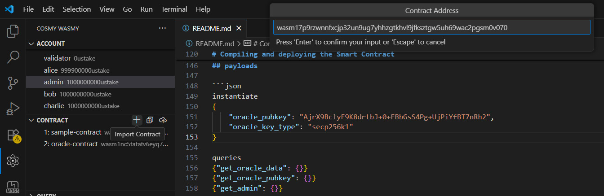
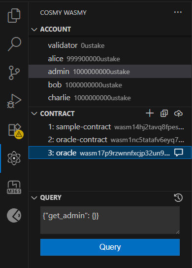
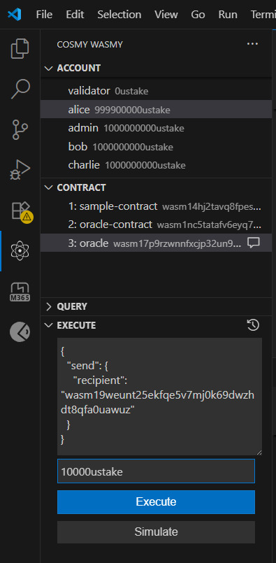

# 🚀 Hackathon Setup Guide

This guide will help you install all the necessary tools to **run a Cosmos SDK chain** and **develop & deploy CosmWasm smart contracts**.  

Please follow the steps carefully in the order given. 

# Prerequisites 
## 1. Install Go
- Download the appropriate installer: [https://go.dev/dl/](https://go.dev/dl/)
- Follow the on-screen instructions to complete installation.

---

## 2. Install Git
- Download Git for Windows: [https://git-scm.com/downloads/win](https://git-scm.com/downloads/win)
- Install with default settings.
- Unless mentioned otherwise, use **Git Bash** for running the commands

---

## 3. Install Visual Studio Code (VS Code)
- Download from: [https://code.visualstudio.com/download](https://code.visualstudio.com/download)
- After installation, install the **Cosmy Wasmy** extension:  
  👉 [Cosmy Wasmy Extension](https://marketplace.visualstudio.com/items?itemName=spoorthi.cosmy-wasmy)

📂 Extension GitHub: [https://github.com/spoo-bar/cosmy-wasmy](https://github.com/spoo-bar/cosmy-wasmy)
- Add this to `cosmywasmy.chains` within `settings.json` of vscode
```json
{
    "configName": "wfchain",
    "chainId": "testing",
    "chainEnvironment": "localnet",
    "addressPrefix": "wasm",
    "rpcEndpoint": "http://localhost:26657",
    "defaultGasPrice": "0",
    "chainDenom": "ustake"
},
```
- To open `settings.json`, open VS Code settings, search for cosmywasmy and click on `Edit in settings.json` 
- Click on the box in the bottom-left of the editor and click on wfchain in the prompt that pops up.
---

## 4. Install Rust
- Download and run the installer: [https://www.rust-lang.org/tools/install](https://www.rust-lang.org/tools/install)  
  (Download the `rustup-init.exe` file)
- After installation, run the following commands in Terminal:

```bash
rustup install 1.86
rustup default 1.86
rustup target add wasm32-unknown-unknown
cargo install wasm-opt
cargo install cosmwasm-check
```

---

## 5. Install Docker & WSL

* Install Docker Desktop: [https://docs.docker.com/desktop/setup/install/windows-install/](https://docs.docker.com/desktop/setup/install/windows-install/)
* Enable WSL by running in **cmd**:

```bash
wsl --install
```

⚠️ If you face WSL installation issues, run in **cmd** with admin privileges:

```bash
bcdedit /set hypervisorlaunchtype auto
```
and restart your machine, it should start working.

Reference: [WSL Issue Fix](https://github.com/microsoft/WSL/issues/9652#issuecomment-1474858120)

---

## 6. Setup the Cosmos Chain with Docker

* Pull the prebuilt blockchain image:

```bash
docker pull --platform linux/amd64 soumithbasina/wfblockchain:latest
```

* Initialize the chain:

```bash
docker run --rm -it --mount type=volume,source=wasmd_data,target=//root/.wasmd \
  soumithbasina/wfblockchain:latest //opt/setup_wasmd.sh
```

* Run the chain:

```bash
docker run --rm -it -p 26657:26657 -p 26656:26656 -p 1317:1317 \
  --mount type=volume,source=wasmd_data,target=//root/.wasmd \
  soumithbasina/wfblockchain:latest //opt/run_wasmd.sh
```

* To reset the blockchain state:

```bash
docker volume rm -f wasmd_data
```

---

## 7. Install Node.js & npm

* Download the prebuilt Node.js + npm binaries: [https://nodejs.org/en/download/](https://nodejs.org/en/download/)
* Complete installation with default options.
* Install `cosmwasm-ts-codegen`: 
```bash
npm install -g @cosmwasm/ts-codegen@1.6.0
```

## 8. Install Postman
* Download the binary: [https://www.postman.com/downloads/](https://www.postman.com/downloads/)
* Import the Postman Collection found in `oracle-service` directory.

# Compiling and deploying the Smart Contract
We have created a sample cosmwasm smart contract with some basic functionality. 
* `Send()` is a basic wrapper around `BankMsg`. Sends the tokens to a receiver's address.
* `OracleDataUpdate()` updates the data stored in smart contract state with the new provided string. Also verifies signature to ensure the data is signed by oracle.
* `UpdateOracle()` updates the public key of the oracle.

## Compile the smart contract
Change working directory
```bash
cd sample-contract
```
Build WASM
```bash
RUSTFLAGS="-C link-arg=-s" cargo wasm
```
Confirm `sample_contract.wasm` is listed
```bash
ls target/wasm32-unknown-unknown/release/sample_contract.wasm
```
Optimize WASM
```bash
wasm-opt -Os --signext-lowering ./target/wasm32-unknown-unknown/release/sample_contract.wasm -o ./target/wasm32-unknown-unknown/release/sample_contract_opt.wasm
```
Validate sample_contract_opt.wasm
```bash
cosmwasm-check ./target/wasm32-unknown-unknown/release/sample_contract_opt.wasm
```

## Deploy the smart contract
By now the optimized contract should be ready, We will be deploying this optimized contract on the local blockchain.

### Import accounts 
Let's first import the accounts into the cosmy wasmy so we can use them further.
Right click on the Beaker.toml file and click Sync Beaker config.



### Upload a smart contract

Let's first select the admin account for deploying and instantiating the Smart acoount. 



The, right click on sample_contract_opt.wasm and click Upload Contract.



Output would be something like this, Note down the code_id 



### Instantiate the smart contract

Now let's instantiate the smart contract, select the admin account enter the code_id in respective box and provide the conntract label and use the follwing json as the payload and then click on Initialize.
```json
{
    "oracle_pubkey": "AjrX9BclyF9K8drtbJ+0+FBbGsS4Pg+UjPiYfBT7nRh2",
    "oracle_key_type": "secp256k1"
}
```


Output would be something like this, note down the contractAddress.


### Import the smart contract

Click on the + in CONTRACT row and paste your smart contract address obtained from the previous step and click enter. Your contract will now be imported inside the cosmy wasmy extension and can be used then for interacting with the contract. It will appear under the CONTRACT tab with the name we specified while instantiating it.



### Query the smart contract

Now let's query the smart contract admin. Put the follwing json as payload.
```json
{"get_admin": {}}
```


Similarly you can run the other queries using the following payloads.
```json
{"get_oracle_data": {}}
{"get_oracle_pubkey": {}}
```

### Execute the smart contract

Now let's execute the send on the smart contract. Put the follwing json as payload and put the amout to be transferred in the respective box. You can change the reciepient in the payload and select the sender from the ACCOUNT tab and the smart contract from CONTRACT tab.
```json
{
  "send": {
    "recipient": "wasm175vkrltwkfshvqa539xzu7gwqjppz8p5ltuj4x"
  }
}
```


Similarly you can run the other execute using the following payloads.
```json
{
    "update_oracle": {
        "new_pubkey": "AjrX9BclyF9K8drtbJ+0+FBbGsS4Pg+UjPiYfBT7nRh2",
        "new_key_type": "secp256k1"
    }
}
```

# Building and running oracle-service
## Generating a cosmjs client for the contract
Command for installing `cosmwasm-ts-codegen` should be in the prerequisites. Ensure it is installed.

Make sure to run this after making changes to the contract and deploying it so that the service can interact with the contract properly.

Go to the contract directory and build schema
```bash
cd sample-contract
cargo schema
```

Run the cosmwasm-ts-codegen command to generate client from the JSON schema file.
```bash
cosmwasm-ts-codegen generate \
    --plugin client \
    --schema ./schema \
    --out ../oracle-service/src/sdk \
    --name oracle
```
Answer the prompt accordingly
```bash
? [bundle] enable bundle? No
```
The newly generated files should be in `oracle-service/src/sdk`

## Running and interacting with the oracle service
Run the oracle service
```bash
cd oracle-service
npx ts-node src/app.ts
```
Ensure the chain is also running.

Open Postman, ensure the collection is imported.
Two types of requests there - `get-oracle-data` and `update-oracle-data`.

Run these to check if the connection is working. 

# Public Crypto Data

See article from GCP: https://cloud.google.com/blog/products/data-analytics/introducing-six-new-cryptocurrencies-in-bigquery-public-datasets-and-how-to-analyze-them

## Pulling and preparing data
We have extracted samples from bitcoin (`bigquery-public-data.crypto_bitcoin`) and ethereum (`bigquery-public-data.crypto_ethereum`) datasets from BigQuery and have uploaded to https://storage.googleapis.com/blockchain-hackathon/hackathon.zip. 
* A 1% sample was queried from each table
* Ethereum traces and Bitcoin transactions were limited further due to the size of the response.

Download and extract the folder (and sub folders) to `./data`. Tree folder should look like:

```
wfHackathon
├── data
    ├── btc
        ├── btc-inputs1
        ├── btc-inputs2
        ├── btc-inputs3
        ├── btc-inputs4
        ├── btc-inputs5
        ├── btc-outputs1
        ├── btc-outputs2
        ├── btc-outputs3
        ├── btc-outputs4
        ├── btc-blocks000000000000.csv
        └── btc-transactions000000000000.csv
    ├── eth
        ├── eth-balances
        ├── eth-blocks
        ├── eth-logs1
        ├── eth-logs2
        ├── eth-logs3
        ├── eth-logs4
        ├── eth-logs5
        ├── eth-logs6
        ├── eth-logs7
        ├── eth-sessions
        ├── eth-token_transfers
        ├── eth-transactions1
        ├── eth-transactions2
        ├── eth-transactions3
        ├── eth-transactions4
        ├── eth-transactions5
        ├── eth-transactions6
        ├── eth-transactions7
        ├── eth-contracts000000000000.csv 
        ├── eth-load_metadata.csv  
        ├── eth-tokens000000000000.csv 
        └── eth-traces000000000000.csv
    └── cleanup.sh
└── docker
...
```
Two folders will need cleaned up (filenames appended with .csv)
```bash
cd data
./cleanup.sh
```

Pull postgres image
```bash
docker pull postgres:15
```

Run postgres Container. This command will execute the scripts under ./db-scripts (create databases/schema and load sample data). To load all data, modify [./db-scripts/03-load-data.sh](./db-scripts/03-load-data.sh). 
```bash
docker run -d --name postgres -v $(pwd)/data:/crypto_data \
  -v $(pwd)/db-scripts:/docker-entrypoint-initdb.d/ \
  -e POSTGRES_USER=postgres -e POSTGRES_DB=postgres -e POSTGRES_PASSWORD=password \
  postgres:15
```

Once your container is running, exec into it:
```bash
docker exec -it postgres bash
```

Then you can run verify db was populated:
```bash
psql -h localhost -U postgres -d bitcoin

# confirm tables are listed
\d

# query from tables. select * ...
```

Cleanup:
```bash
docker stop postgres
```
Likely will want to avoid running `docker rm postgres` once all data is loaded.

# ✅ You are now ready!

With the above setup, you can:

* Run a local Cosmos SDK blockchain.
* Develop and deploy a cosmwasm smart contract.
* Build and run the oracle service.
* Pull data into a local Postgres instance. 